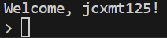

# Personal assistant-like chatbot

## Features

- Will remember you
- Can help you use a few tools, like r/w QR codes, Whisper, and ffmpeg/imagemagick

## Known issues

- Code will likely only work on Windows
- Some errors will cause the script to catastrophically fail.

## Installation and usage

See [here](https://hackclub.jclink.link/documentations/other/gemini-multichatbot.html)

##Image

This is a terminal application and will mostly look like a terminal, and it will greet *you*, not me, but...

...this is what it looks like for me!